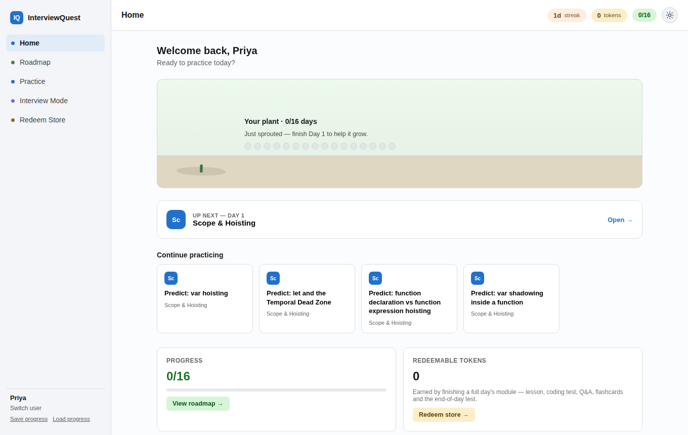
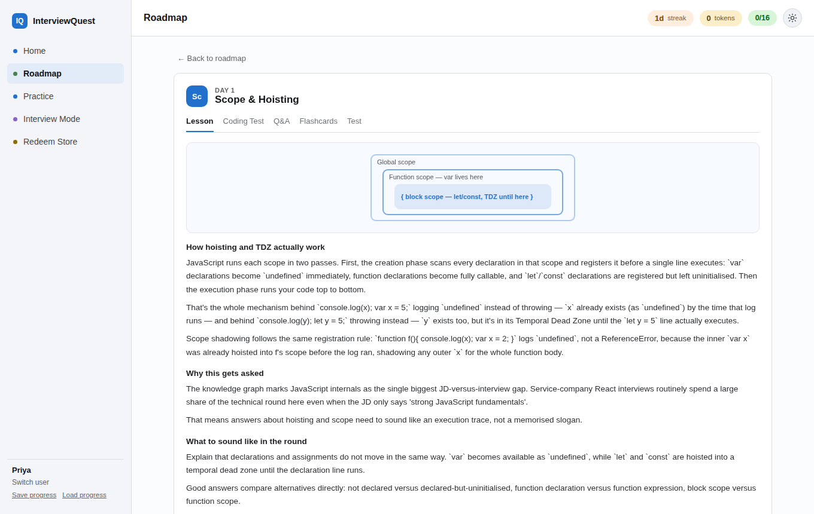

# InterviewQuest (ReactQuest)

A gamified, 16-day interview-prep platform for **React / Frontend developers (3+ years)** targeting India IT-services roles (TCS, Infosys, Wipro, Cognizant, Accenture, Capgemini and similar). It runs entirely in the browser: no backend, no build step, no password.





## Features

- **16 daily modules**: Scope & Hoisting, closures, the event loop, React rendering and more, each with a lesson, coding test, Q&A, flashcards and an end-of-day test.
- **Practice mode**: "predict the output" style questions you can run against an in-browser execution engine.
- **Interview mode**: mock-interview style questions.
- **Gamification**: daily streak, tokens earned per finished day, a plant that grows as you progress, and a redeem store.
- **Light / dark theme**, with your choice remembered.
- **Local progress**: pick a name and progress is saved in `localStorage`; use *Save progress* / *Load progress* to export and import it.

## Run it

It's a static site, so any static server works.

```bash
git clone https://github.com/xreedev/ReactQuest.git
cd ReactQuest
python3 -m http.server 8000   # then open http://localhost:8000
```

Opening `index.html` directly via `file://` won't work, because the app loads ES modules. The page also loads React and Babel from unpkg and fonts from Google Fonts, so it needs internet access.

## Deploy on GitHub Pages

1. Go to **Settings → Pages**.
2. Under **Build and deployment**, choose **Deploy from a branch**.
3. Select your branch and the `/ (root)` folder, then save.

The site will be served at `https://<user>.github.io/ReactQuest/`.

## Project layout

| Path | Purpose |
|---|---|
| `index.html` | The whole app (UI, routing, state) |
| `content-data.js` | Lessons, questions, flashcards and tests |
| `exec-engine.js` | In-browser code execution for coding tests |
| `support.js`, `image-slot.js` | Runtime support scripts used by the page |
| `uploads/` | Source content the data was built from |
| `wiki/` | The underlying research wiki: interview loops, knowledge graph, question bank, study plan and CV guidance (start at [`wiki/README.md`](wiki/README.md)) |
| `questions/` | Raw question notes |
| `docs/` | README screenshots |

## Content source

All study content derives from the research in [`wiki/`](wiki/), compiled from candidate-reported interview write-ups and live job descriptions. See [`wiki/12-sources.md`](wiki/12-sources.md) for sources and confidence ratings.
